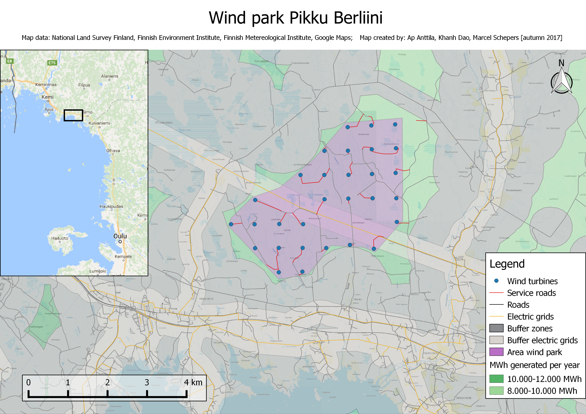

 
# Wind power park site planning project - Pikku Berliini

#### Authors:  Ap Anttila, Khanh Dao, Marcel Schepers

This project is aimed planning a small to medium wind power park side using QGIS.
The result wind power park “Pikku Berliini” with a capability of approximately 
300 GWh was designed into northern parts of Finland. The site is planned considering
following requirements:
#### 
- Distance to buildings (residential, commercial, industrial)
- Viewshed of the turbines
- Distance to roads and railroads
- Any nearby airports
- Nature protection and other special use areas
- Wind conditions
- Elevation and slope

#### Data sources
- [PaiTuli service]
- National Land Survey (NLS) Topographic Dataset
- National Land Survey (NLS) Elevation Model
- Finnish Environment Institute (SYKE), 
nature conservation areas and NATURA 2000 datasets
- Wind speed data from [Tuuliatlas]

[Paituli service]: https://research.csc.fi/paituli
[Tuuliatlas]: http://tuuliatlas.fmi.fi/fi/#
